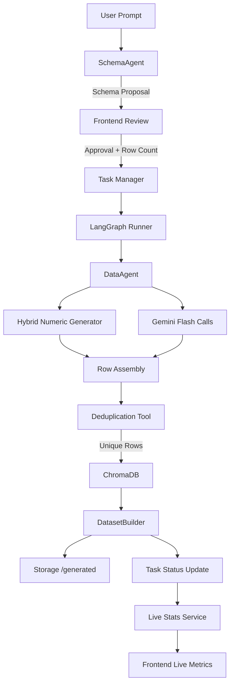

# Dataset Generation Workflow

## Steps in Detail

1. **Prompt Submission** – The user describes their desired dataset in natural language.
2. **Schema Generation** – SchemaAgent consults Gemini 1.5 Pro to craft a structured schema, including column metadata and constraints.
3. **Human-in-the-loop Approval** – Frontend displays the schema for confirmation and row count selection.
4. **Task Orchestration** – Approved requests create asynchronous tasks via `TaskManager`.
5. **LangGraph Execution** – DataAgent orchestrates chunked data generation using LangGraph, ensuring high throughput and resilience.
6. **Hybrid Numeric Augmentation** – Numeric columns optionally bypass LLM calls using deterministic generators to reduce token spend.
7. **Deduplication** – MCP tool compares row hashes in ChromaDB to prevent duplicates across batches.
8. **Persistence** – DatasetBuilder writes CSV/JSON outputs to `/generated`, ready for download.
9. **Monitoring** – `stats_service` surfaces rows per second, active tasks, and token spend for real-time dashboards.
